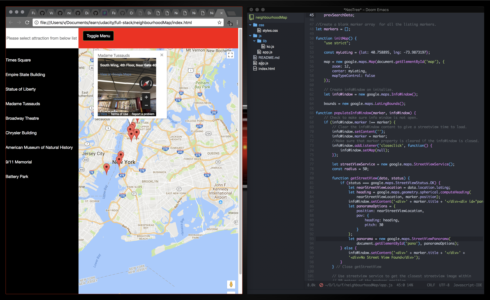

# neighbourhoodMap



An (admittedly hideous) neighbourhood map of New York project for the [Udacity Full Stack
Nanodegree](https://classroom.udacity.com/nanodegrees/nd004/) using the Google
Maps and Wikipedia APIs, [Knockout.js](http://knockoutjs.com/), Ajax, and jQuery.

## Buliding

Static `HTML`, referencing the `css/` and `js/` folders. 

```
git clone https://github.com/vvkmnn/neighbourhoodMap.git
open index.html
```
And you sould be good to go!
